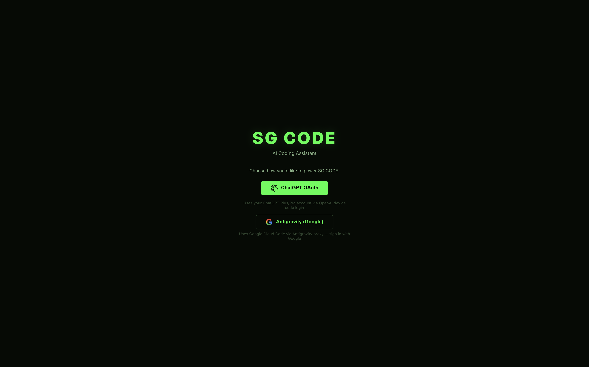
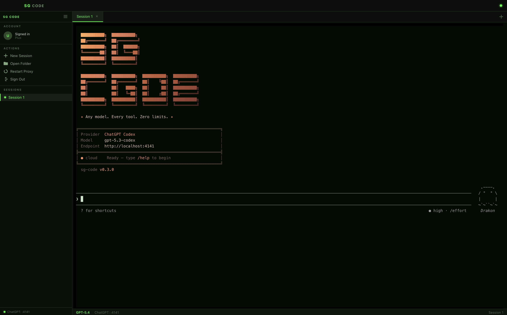
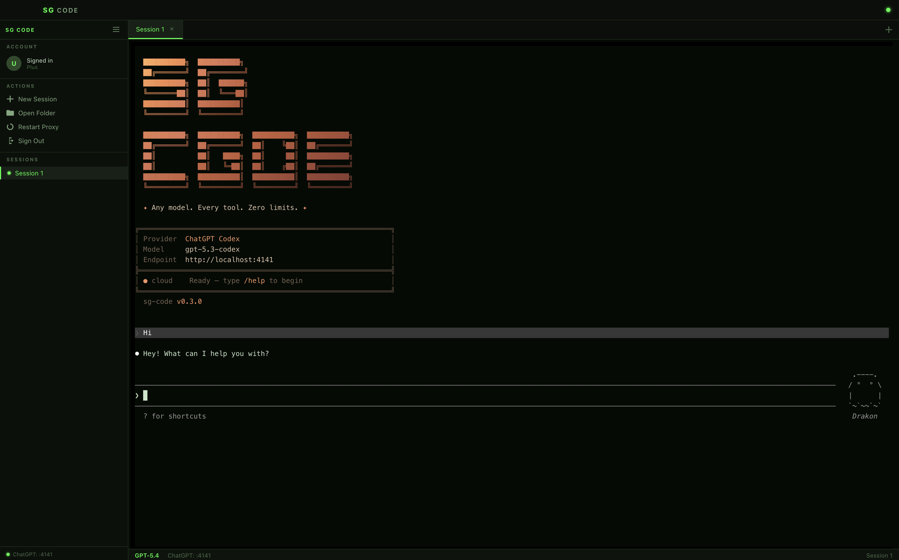

<div align="center">

# ⚡ SG CODE

### Claude Code-like AI Coding Assistant — Native Desktop Terminal

**Open-source architecture inspired by Claude Code. Use ChatGPT, Claude, or Gemini models in a blazing-fast terminal IDE.**

[](https://github.com/mastershivek07/sg-code/releases/latest)
[](https://github.com/mastershivek07/sg-code/releases/latest)

---

</div>

## What is SG CODE?

SG CODE is a **Claude Code-like** desktop application that gives you an AI coding assistant right in your terminal. It uses the same agentic architecture — the AI can read your code, edit files, run commands, create branches, and reason about your entire project. The key difference: **you choose your AI provider**.

**No API keys needed.** Sign in with your existing ChatGPT or Google account.

## Features

- **Multi-Provider Support** — Choose between ChatGPT (OpenAI) or Google AI (Claude, Gemini) models
- **Native Terminal** — Full xterm.js terminal with 256-color support, not a web wrapper
- **Multi-Tab Sessions** — Run multiple coding sessions side by side
- **Model Switching** — Switch between models on the fly (`/model`)
- **Auto-Updates** — Always stay on the latest version
- **Cross-Platform** — macOS and Windows

## Supported Models

### ChatGPT Provider (OpenAI)
| Model | Description |
|-------|-------------|
| `gpt-5.4` | GPT-5.4 — flagship, reasoning + vision (default) |
| `gpt-5.4-pro` | GPT-5.4 Pro — extended reasoning (Pro plan) |
| `gpt-5.4-mini` | GPT-5.4 Mini — fast reasoning |
| `gpt-5.4-nano` | GPT-5.4 Nano — fastest |
| `gpt-5.2` | GPT-5.2 — previous gen reasoning |
| `gpt-5.2-pro` | GPT-5.2 Pro — previous gen extended |
| `gpt-4.1` | GPT-4.1 — legacy all-rounder |
| `gpt-4.1-mini` | GPT-4.1 Mini — legacy fast |
| `gpt-5.4-codex` | [Codex] GPT-5.4 via ChatGPT backend |
| `gpt-5.4-mini-codex` | [Codex] GPT-5.4 Mini via ChatGPT backend |
| `gpt-5.3-codex` | [Codex] GPT-5.3 Codex |
| `gpt-5.3-codex-spark` | [Codex] GPT-5.3 Codex Spark (entitlement) |
| `gpt-5.2-codex` | [Codex] GPT-5.2 Codex |
| `gpt-5.1-codex` | [Codex] GPT-5.1 Codex (legacy) |

### Google Provider (Antigravity)
| Model | Description |
|-------|-------------|
| `claude-opus-4-6-thinking` | Most capable reasoning model with extended thinking |
| `claude-sonnet-4-6` | Fast + capable (default) |
| `gemini-2.5-pro` | Google's flagship model |
| `gemini-2.5-flash` | Fast and efficient |
| `gemini-2.5-flash-lite` | Lightweight, ultra-fast |
| `gemini-2.5-flash-thinking` | Flash with chain-of-thought |
| `gemini-3-pro-high` | Next-gen high quality |
| `gemini-3-pro-low` | Next-gen cost-effective |
| `gemini-3-flash` | Next-gen fast |
| `gemini-3-flash-agent` | Optimized for agentic tasks |
| `gemini-3.1-pro-high` | Latest gen high quality |
| `gemini-3.1-pro-low` | Latest gen cost-effective |
| `gemini-3.1-flash-image` | Multimodal flash |
| `gemini-3.1-flash-lite` | Ultra-lightweight |

## Quick Start

1. **Download** the latest release for your platform
2. **Install** — drag to Applications (macOS) or run the installer (Windows)
3. **Launch** SG CODE
4. **Sign in** with ChatGPT or Google
5. **Start coding** — open a folder and ask the AI anything

## Screenshots

### Provider Selection



### Main Session View



### Active Conversation



## How It Works

SG CODE runs a local proxy that translates between your AI provider account and the coding agent. Everything runs on your machine — your code never leaves your computer (except what you explicitly send to the AI model).

```
┌─────────────┐     ┌──────────────┐     ┌─────────────────┐
│  SG CODE    │────▶│  Local Proxy  │────▶│  ChatGPT / GCP  │
│  Terminal   │◀────│  (localhost)  │◀────│  AI Models      │
└─────────────┘     └──────────────┘     └─────────────────┘
     Your machine         Your machine         Cloud API
```

## System Requirements

| | macOS | Windows |
|---|---|---|
| **OS Version** | macOS 12+ | Windows 10+ |
| **Architecture** | Intel / Apple Silicon | x64 |
| **Disk Space** | ~250 MB | ~250 MB |
| **Account** | ChatGPT or Google account | ChatGPT or Google account |
| **Dependencies** | None | [Node.js](https://nodejs.org/) + [Git for Windows](https://git-scm.com/downloads/win) |

## Keyboard Shortcuts

| Shortcut | Action |
|----------|--------|
| `Cmd/Ctrl + T` | New tab |
| `Cmd/Ctrl + W` | Close tab |
| `/model` | Switch AI model |
| `/help` | Show all commands |
| `Cmd/Ctrl + ,` | Settings |

## FAQ

**Is this free?**
Yes, SG CODE is free. You use your own ChatGPT or Google account for AI access.

**Does it send my code to third parties?**
SG CODE runs entirely on your machine. The only external calls are to the AI model provider you chose (OpenAI or Google), and only when you actively ask the AI for help.

**Can I use it offline?**
The terminal works offline, but AI features require an internet connection to reach the model provider.

**Is this open source?**
The desktop app is distributed as a compiled application. The AI coding engine is based on open-source technology.

## License

SG CODE is free to use. See [LICENSE](LICENSE) for details.

---

<div align="center">

**Made with ⚡ by SG**

[Report Bug](https://github.com/mastershivek07/sg-code/issues) · [Request Feature](https://github.com/mastershivek07/sg-code/issues)

</div>
